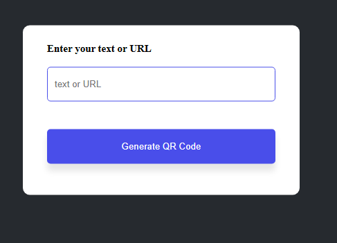
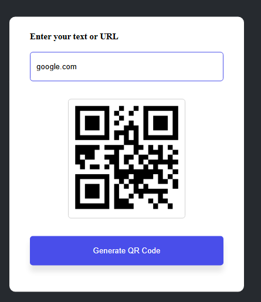

# QR Code Generator App 🧾

A simple and responsive QR Code Generator built with **HTML**, **CSS**, and **JavaScript**. Enter any text or URL and instantly generate a QR code!

## 🚀 Features

- ✅ Generate QR codes from text or URLs
- ✅ Real-time QR code updates

## 🌐 Live Demo

[https://qr-code-generator-abhay-004.netlify.app/](#) <!-- Replace with your GitHub Pages or live site link -->

## 🖼️ Screenshot

 

## 🛠️ Technologies Used

- HTML5
- CSS3 (Flexbox & Responsive Design)
- Vanilla JavaScript
- [QR Code API or Library](https://goqr.me/api/) *(or any library like `QRCode.js`)*
